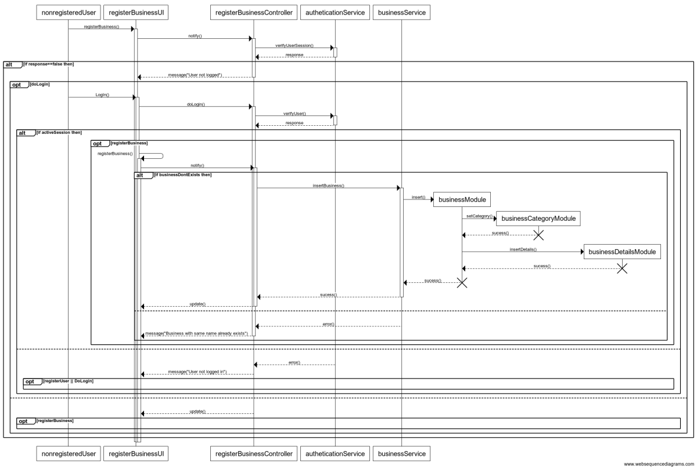

#BGreen-Project Document

In this text I'll explain the analisys, desing, implentation and test of BGreenSite.


#UX Desing

```
1. Strategy:
  1 Business Goals:
    . inform about nocive products on the market which are not healthy and produce
      cancer or other diseases.
    . motivate people to be healthy and to change their habits.
    . help green and eco business to raise over other business.
    . be funny. People needs feeling happy and useful about a change.
    . inform about the Earh resources and the use we do of them.
    . Give trusted and verified information.
  ### User Constituencies:
    . age 16 to death.
    . future (sell to schools too.)
  ### Usage Context:
    . Everywhere during free time (desktop, laptop, tablet, mobile)
    . People's conversations.
    . rss feeds from twitter API(consuming twitter API, filter comments with keywords from lobbies and display them)
```

#Project Folder Estructure
```
.bGreen
   |-EcoBusinessSubsystem
       |-modules
           |-registerBusinessModule.module.js
       |-controllers
       |-filters
       |-directives
       |-services
       |-partials
   |-GetMissionSubsystem
       |-modules
       |-controllers
       |-filters
       |-directives
       |-services
       |-partials
   |-ExternalServicesSubsystem
       |-TwitterRssFeeds
       |-GoogleMaps
```

#Use Case Diagrams

*Manage eco business use case diagram*


*ManageEcoBusiness*


*Register Business Sequence Diagram*


*New Register User*


*Edit My Projects List*


#Forms Verification

#Jazmine Unit Test


