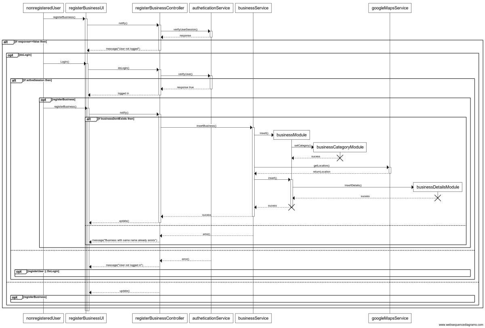
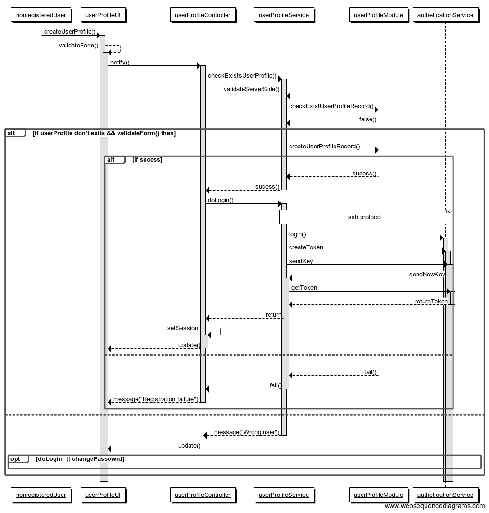

# BGreen-Project Document

In this text I'll explain the analisys, desing, implentation and test of BGreenSite.


# UX Desing

```
1. Strategy
  1. Business Goals:
     . Inform about nocive products on the market which are not healthy and produce
     . Cancer or other diseases.
     . Motivate people to be healthy and to change their habits.
     . Help green and eco business to raise over other business.
     . Be funny. People needs feeling happy and useful about a change.
     . Inform about the Earh resources and the use we do of them.
     . Give trusted and verified information.
  2. User Constituencies:
     . Age 16 to death.
     . Future (sell to schools too.)
  3. Usage Context:
     . Everywhere during free time (desktop, laptop, tablet, mobile)
     . People's conversations.
     . rss feeds from twitter API(consuming twitter API, filter comments with keywords from lobbies and display them)
  4. Promotion
     . Signficative payment to register and announce a new business
     . Facebook enterprise page: pay for advertisements
     . Google Adworks
     . Sustainable events
     . Through bankpayments registered user can get discounts when buying in organic "eco" business
```

# Project Folder Estructure
```
.bGreen
   |-EcoBusinessSubsystem
       |-modules
           |-registerBusinessModule.module.js
       |-controllers
       |-filters
       |-directives
       |-services
       |-partials
   |-GetMissionSubsystem
       |-modules
       |-controllers
       |-filters
       |-directives
       |-services
       |-partials
   |-ExternalServicesSubsystem
       |-TwitterRssFeeds
       |-GoogleMaps
```

# Balsamiq Mockups

[Download balsamiq project here](balsamiq/)

# Use Case Diagrams

*BGreen packages diagram*


*BGreen use case diagram*


*Register new business sequence diagram*


*Register new user sequence diagram*


*Edit projects list sequence diagram*


*Select businesses with close locations*


# Knowlegde analysis

```
Concept: Get mission subsystem ideally would be a web/mobile application that users can download from a market store for free.
         It will retrieve information about user habits (via a questionary), process them, and return a table and buble chart diagram with information about the nutricional status of his/her body, his/her responsible consumist habits, his/her healthy hobbies and his/her contribution to the local/global market.

DOMAIN-KNOWLEDGE: Eating habits
    DOMAIN SCHEMA DESCRIPTION: concepts, relations and rules descripting user habits when eating. How many meals they took per day, their total intakes and nutritinal values. Rules definition to consider a healthy meal base on nutricional values of the food taken.
    On the other hand, user can input brands they use to prepare or buy their meals,statistic study of the local market (clustering by area) and global market.
    KNOWLEDGE BASE DESCRIPTION: Analytical tasks: clasification, assesment  and prediction
                                Synthetic tasks: configuring and asigning confinguration (giving solutions to improve diets)
END DOMAIN-KNOWLEDGE Eating habits

DOMAIN SCHEMA: Nutrition
    DOMAIN SCHEMA DEPENDENCIES: MEALCATEGORY{Breakfast, Lunch, Evening dinner, Snack, Drink},
                                BRAND{Sturbucks, Costa Coffee, Chiquitos, Nandos, Pizza Hut, Yo!, No brand(Generic), Nestle, Coca-cola,
                                Kraft, Dr. Oetker, Pepsi, Lays, BirdsEye, Iceland, The happy egg.co},
                                NUTRIENTS/FOOD {},
    CONCEPTS, RELATIONS, RULES: FOODS[List[nutrients,proportion]] o-> MEALS[List[food,portion]] [x] -> NUTRITIONSTATUS[List[meal,status]]
END DOMAIN SCHEMA: Nutrition


#########################################################################
CONCEPT: USER
#########################################################################
CONCEPT user:
   DESCRIPTION
    "User registered for Get Mission Application"
   ATTRIBUTES
    name: STRING
    nationality: STRING
    age: INT
   AXIOMS
    age >= 16
END CONCEPT user
#########################################################################
CONCEPT: REQUEST ASSESMENT
#########################################################################
CONCEPT request:
    DESCRIPTION
    "User request assesment for a healthy diet"
    ATTRIBUTES
       age: INT
       job-profile: {Administrative and clerical, Alternative therapies, Animals, plants and land, Arts, crafts and design, Catering services ,Construction,
       Education and training, Environmental sciences, Financial services, General and personal services, Information technology and information management,
       Legal services, Maintenance, service and repair, Management and planning, Manufacturing and engineering, Marketing, selling and advertising, Medical technology,
       Medicine and nursing, Performing arts, broadcast and media, Publishing and journalism, Retail sales and customer service, Science and research,
       Security and uniformed services, Social services, Sport, leisure and tourism, Storage, dispatching and delivery, Transport}
       weight: INT
       height: INT
       Known medical conditions: {Alcohol abuse and alcoholism, Allergies, Alopecia areata, Amputation, Anxiety disorders, Arthritis ,Asperger syndrome ,Asthma,
       Attention deficit hyperactivity disorder (ADHD), Autism and autism spectrum disorders, Bipolar disorder, Bleeding disorders, Blindness and low vision,
       Brain injury, Burn injury, Cancer, Celiac disease, Cerebral palsy, Charcot-Marie-Tooth disease, Chronic fatigue syndrome, Chronic illness, Cleft lip and palate
       Crohn's disease, Cystic fibrosis, Deafness and being hard of hearing, Depression, Diabetes, Down syndrome, Drug abuse and addiction, Dwarfism,
       Eating disorders, Endometriosis, Epilepsy, Eczema, Fetal alcohol syndrome, Fibromyalgia, GERD (Gastroesophageal Reflux Disease), Growth hormone deficiency,
       Heart diseases, HIV/AIDS, Huntington's disease, Inflammatory bowel disease, Intellectual disabilities (Formerly mental retardation), Juvenile rheumatoid ,
       Kidney disease, Lactose intolerance, Learning disabilities, Lupus, Migraine, Mental health, Mono(nucleosis), Multiple sclerosis, Muscular dystrophy,
       Narcolepsy, Obesity, Obsessive compulsive disorder (OCD), Polycystic ovary syndrome (PCOS), Post-traumatic stress disorder, Psoriasis, Scleroderma,
       Scoliosis, Sickle cell anemia, Speech and language disorders, Spina bifida, Spinal cord injury, Stroke, Thyroid disease, Tourette syndrome, Turner syndrome,
       Ulcerative colitis, Ulcers, Williams syndrome}
       HAS-PARTS: list_of_meals
END CONCEPT request
############################################################################
CONCEPT: MEAL
############################################################################
CONCEPT meal:
  DESCRIPTION "Possible different meals the user has taken"
  SUPERTYPE-OF: Meal Category
        ATTRIBUTES
           %calories : KJules/Kcal
           %proteins : int
           %carbs: int
           %fat: int
        HAS-PARTS: lists_of_foods
        AXIOMS:
    <12-20% Proteins, <50-55% carbs, <25-30% fat: need to do meals with nutrients contained in proteins, carbs and fat
          <12-20% Proteins, >50-55% carbs, <25-30% fat:
          <12-20% Proteins, <50-55% carbs, >25-30% fat:
          12-20% Proteins,  50-55% carbs,  25-30% fat:
          >12-20% Proteins, >50-55% carbs, >25-30% fat:
          >12-20% Proteins, <50-55% carbs, >25-30% fat:
          >12-20% Proteins, >50-55% carbs, <25-30% fat:
END CONCEPT meal
############################################################################
CONCEPT:FOOD
############################################################################
CONCEPT food:
  DESCRIPTION: "List of nutrients per intake"
        SUBTYPE-OF: meal
        ATRIBUTES
END CONCEPT food
############################################################################
CONCEPT: NUTRICION STATUS
############################################################################
CONCEPT nutricionStatus:
     DESCRIPTION
     "Nutricion status after assesment"
     ATTRIBUTES
     weight4age status: {standar, mild, moderate, sever, more sever}
     height4age: {normal, stunting, severe stunting}
     weight4height: {normal, wasting, severe wasting}
     index mass: {underweight, normal, overweight}
     AXIOMS:
       12-20% Proteins, 50-55% carbs, 25-30% fat, weight4age status standar, height4age normal, index mass normal  = healthy
       <12-20% Proteins, < 50-55% carbs, < 25-30% fat, weight4age status standar, height4age normal, index mass normal  = medium healthy
       >12-20% Proteins, > 50-55% carbs, > 25-30% fat, weight4age status standar, height4age normal, index mass normal  = unhealthy
END CONCEPT
END DOMAIN SCHEMA Nutrition

```

# Forms Verification

Html validation :(https://validator.w3.org)

# Jazmine Unit Test


